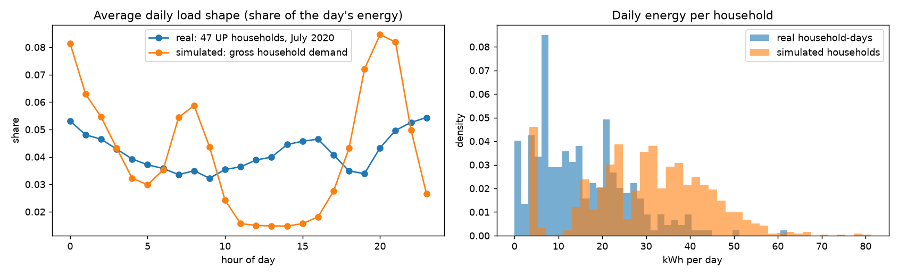

# AETHERGRID: 3D World Simulation


A browser-based 3D simulation of a 24-society electricity district, built for
Smart India Hackathon 2026 (AI-based electricity demand optimisation in smart buildings).
The optimisation and forecasting stack lives in
[aethergrid-omega](https://github.com/UtkarshOver9000/aethergrid-omega).

**Live:** https://aethergrid-worldsim.vercel.app
**Local:** `python -m http.server 8020` then open
<http://localhost:8020/viz3d/index.html>.

## What it is

Twenty-four societies (~1,300 households) on one shared feeder. Six run under
GridBrain coordination; eighteen run unmanaged and genuinely trip. Every number
the renderer draws comes from a real simulation run in `aethergrid/worldsim/` —
the browser only plays back pre-generated JSON, it never computes physics.

## The matched-triplet design

Each society is simulated three ways, sharing an identical seed, household
count, EV/solar penetration and transformer rating. Only the deployment flags
differ:

| arm | curtailment | solar-sync | station | meaning |
|---|---|---|---|---|
| `raw` | off | off | 0 | nothing deployed |
| `ai` | on | on | 0 | coordination only — **zero capex** |
| `full` | on | on | 60 kWp | coordination + community solar station |

So `(ai − raw)` is the value of coordination alone and `(full − ai)` is what the
solar hardware adds. Reporting the bundled figure as "what the AI saved" would
credit a hardware purchase to the algorithm. `generate_district.py` asserts the
controlled fields are identical across arms and fails if they ever drift.

**Result across the district:** coordination alone accounts for the large
majority of the peak reduction and removes every transformer trip, at zero
capital cost. The solar station is real added value but is the smaller half —
and it costs money. Solar generates nothing after sunset, so it cannot shave an
evening peak; it is a cost lever, not a peak lever. That is stated in the UI
rather than averaged away.

## Honesty rules

- Illustrative values are labelled as such: the demonstration tariff
  (₹7.2/kWh), export rate, ₹1,200/kVA capex default, and the simplified
  IEC-style transformer-ageing curve.
- Real cited constants: CEA grid emission factor (0.716 kg CO₂/kWh), TNERC
  HT-I-A tariff structure, RDSS programme milestones.
- Anything the engine does not model — voltage quality, harmonics, crew
  restoration times, the operations console — is badged as a callout or a
  mockup, never presented as simulated output.

## Layout

```
viz3d/          the 3D renderer (Three.js via CDN importmap, no build step)
commercial3d/   the commercial pitch slideshow
viz/data/       pre-generated simulation output the renderer reads
aethergrid/worldsim/   the Python simulation engine
```

## Reality check against real households

This is a simulator: every household is generated from hand-set archetypes
(`aethergrid/worldsim/archetypes/households.py`), not measured data.
`python -m aethergrid.worldsim.validate_ceew` compares the simulated households with
real smart-meter data from Uttar Pradesh: the CEEW Mathura and Bareilly dataset
(Agrawal et al., 2021, Harvard Dataverse, doi:10.7910/DVN/GOCHJH, CC0).

It uses July 2020, the same month as the simulated day, and only complete days with grid
supply in every hour. Results are in `reports/ceew_validation.json`.

| Per household per day | Real (47 households, 288 household-days) | Simulated gross demand (1,314 households, raw arm) |
|---|---|---|
| Median energy | 13.14 kWh | 30.68 kWh |
| 10th-90th percentile | 3.64-28.58 kWh | 12.82-47.06 kWh |
| Mean energy | 15.11 kWh | 30.21 kWh |
| Peak hour of the average day | 23:00 | 20:00 |
| Share of energy used 18:00-23:00 | 21.43% | 33.15% |

Correlation between the two average 24-hour shapes: 0.186.



**What this means.** The simulated households use **2.33× more energy** than these real
UP households, and the shape of their day doesn't match well:
- The simulated archetypes assume 50-95% AC ownership and 28-85% EV penetration per
  society. The real homes' median of 13.14 kWh/day is far below what that appliance mix
  produces.
- Real homes peak at 23:00, when night-time cooling is on. The simulated ones peak in
  the early evening.

So the absolute kWh and peak figures in the viewer describe that hypothetical district,
not a typical Indian neighbourhood. The *relative* results (coordination vs no
coordination on identical societies, below) don't depend on the absolute level. The
next step is to fit the archetype parameters to the CEEW profiles.

## Tests

`python -m pytest -q aethergrid/worldsim/tests`: 5 tests. They check a full simulated
day, that the raw arm never curtails, seed reproducibility, the matched-pair design, and
the real-data loader on a 2-day sample of 3 real Bareilly households. CI runs them on
every push.

## Regenerating the data

```bash
pip install -r requirements.txt
python -m aethergrid.worldsim.generate_scenarios
python -m aethergrid.worldsim.generate_colony
python -m aethergrid.worldsim.generate_whatif
python -m aethergrid.worldsim.generate_solar_sync
python -m aethergrid.worldsim.generate_district
```

Runs are deterministic: the same seed produces byte-identical output.

The JSON files in `viz/data/` are generated output that the static site loads; they are
marked as generated in `.gitattributes`, so GitHub collapses them in diffs.

## Deployment

Static — no build step. `vercel.json` redirects `/` and `/worldsim` to
`/viz3d/index.html` and `/commercial` to `/commercial3d/index.html`.
`.vercelignore` excludes the Python engine and the unused per-society detail
exports, keeping the deployed payload around 42 MB.
